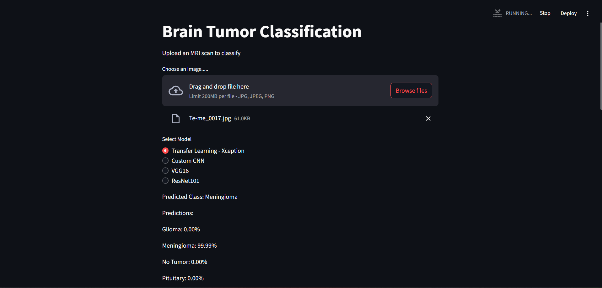
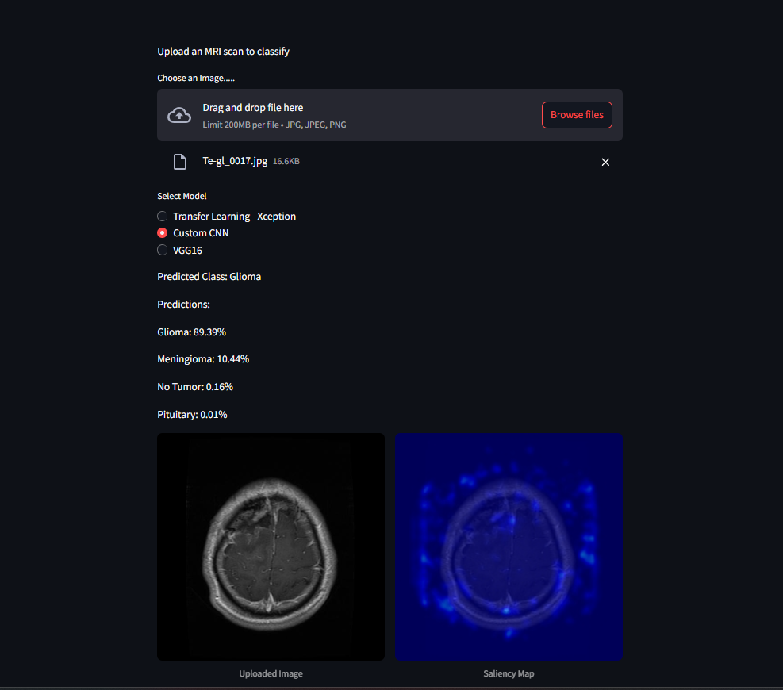
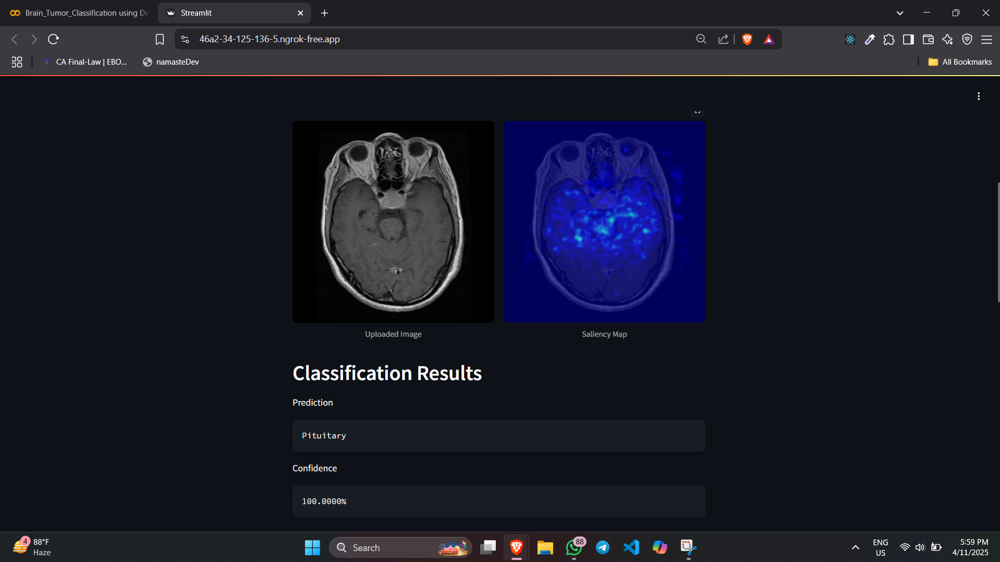
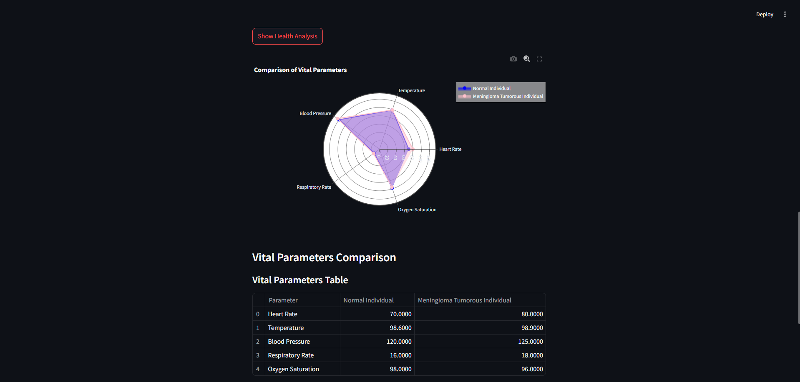
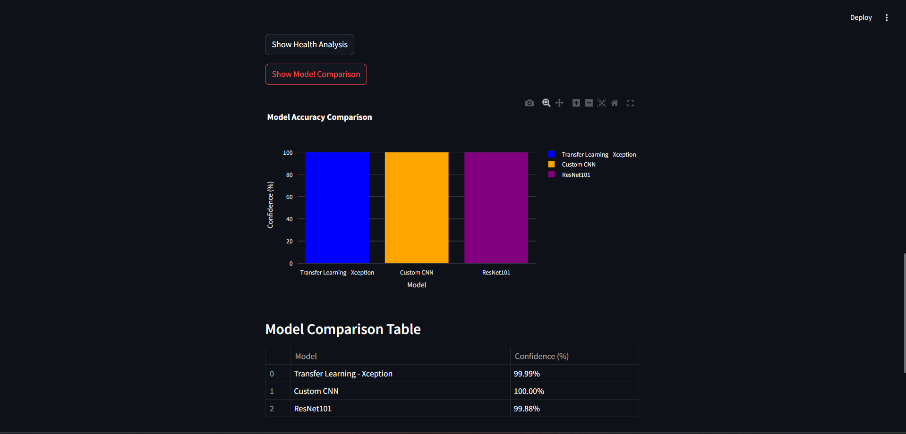

# 🧠 Brain Tumor Classification Using Deep Learning and Streamlit

## 📌 Overview
This project develops a deep learning system to classify brain tumor MRI images into four categories: **Glioma**, **Meningioma**, **Pituitary**, and **No Tumor**, achieving **~99% accuracy**.  
We leverage:  
- Deep learning models: CNN, ResNet101, VGG16, and Xception  
- Transfer learning techniques  
- A **Streamlit-based web app** for real-time inference  
- Optimized deployment for **GPU environments**  

> Built using ECE domain expertise in signal & image processing.

## 🚀 Features
- **Deep Learning Models**:  
  - Custom CNN (**~3.7M parameters**)  
  - ResNet101 (**~43.7M parameters**)  
  - VGG16 (**~138M parameters**)  
  - Xception (**~21.1M parameters**)  

- **Streamlit Web App**:  
  - Upload MRI scans  
  - Select a model  
  - Get predictions with **probability bar charts**  

- **Data Processing**:  
  - Resize to **150x150** (CNN, ResNet101, VGG16) or **299x299** (Xception)  
  - Normalize pixel values to [0, 1]  
  - Augmentations: **zoom**, **rotate**, **flip**  

- **Visualizations**:  
  - Confusion matrix heatmap  
  - Accuracy/loss training curves  
  - Model confidence charts  

- **Performance**:   
  - 99% test accuracy  
  - ~98% recall (low false negatives)  

## 📂 Dataset
- **Source**: [Kaggle Dataset](https://www.kaggle.com/datasets/masoudnickparvar/brain-tumor-mri-dataset)  
  A custom dataset of ~7022 labeled MRI images.

- **Split**:
  - Training: ~5711 images
  - Testing: ~1311 images

- **Classes**: Glioma, Meningioma, Pituitary, No Tumor
- **Note**: Dataset is a placeholder in `Dataset/` due to size; contact for access details.  

## 🛠️ Requirements
- **Python**: 3.8+  
- **Libraries**:  
  - `tensorflow`, `keras`, `streamlit`, `numpy`, `pandas`  
  - `matplotlib`, `seaborn`, `scikit-learn`, `pillow`, `jupyter`  
- **Hardware**: GPU recommended (NVIDIA CUDA-enabled)  

## ⚙️ Installation
### 1. Clone the Repository
```bash
git clone https://github.com/Ouro-Mancer/Brain-tumor-APP.git
cd Brain-tumor-APP
```

### 2. Create a Virtual Environment (Recommended)
```bash
python -m venv venv
source venv/bin/activate  # On Windows: venv\Scripts\activate
```

### 3. Install Dependencies
```bash
pip install -r requirements.txt
```

### 4. Model Weights
Ensure these files are present in `Models/`:
```plaintext
CNN_model.h5
ResNet101_model.h5
VGG16_model.h5
Xception_model.h5
```
If missing, train models using `Brain Tumor Classification.ipynb`.

### 5. Running the Streamlit Web App
```bash
streamlit run app.py
```

**App Features**:  
- Upload MRI scan (PNG/JPG)  
- Select model (e.g., Xception)  
- View predictions + confidence chart  

**Example**:  
Upload `Dataset/Testing/meningioma/Te-me_001.jpg` → Output: "Meningioma" with 0.7 probability  
 

## 💻 Technologies Used
- **Deep Learning**: TensorFlow, Keras, CNN, ResNet101, VGG16, Xception  
- **Web Development**: Streamlit, Python  
- **Data Processing**: NumPy, Pandas, Pillow, Scikit-learn  
- **Visualization**: Matplotlib, Seaborn  
- **ECE Skills**: Signal processing (MRI as signals), image processing (preprocessing), GPU optimization  

## 🔮 Future Improvements
- Deploy Streamlit app on Streamlit Cloud for global access  
- Expand dataset (>7022 images) for better model robustness  
- Optimize models for edge devices (e.g., FPGAs) for portable diagnostics  
- Add multi-language support to the web app for broader accessibility  

## 🤝 Contributing
We welcome contributions to enhance this project! Whether you're fixing bugs, adding features, or improving documentation, your input is valuable. Here's how to contribute:  
- **Fork the Repository**: Click the "Fork" button on GitHub to create your own copy.  
- **Clone Your Fork**:  
  ```bash
  git clone https://github.com/your-username/Brain-tumor-APP.git
  cd Brain-tumor-APP
  ```  
- **Create a Feature Branch**:  
  ```bash
  git checkout -b feature/your-feature-name
  ```  
- **Make Changes**: Implement your feature or fix, ensuring code quality and documentation.  
- **Commit Changes**:  
  ```bash
  git commit -m "Add your feature or fix description"
  ```  
- **Push to Your Branch**:  
  ```bash
  git push origin feature/your-feature-name
  ```  
- **Open a Pull Request**: Submit a PR on GitHub, describing your changes and their impact.  
**Guidelines**:  
- Ensure your code follows PEP 8 style guidelines.  
- Test your changes locally (e.g., run `streamlit run app.py`).  
- Update documentation if needed (e.g., add new features to README).  

## 📬 Contact
- **Name**: Mayank Kumar Das  
- **Email**: mayankkumardas12@gmail.com  
- **LinkedIn**: [linkedin.com/in/mayank-kumar-das-76231026b](https://linkedin.com/in/mayank-kumar-das-76231026b)  


## 📊 Results  
- **Visualizations**:  
  - **Streamlit App Screenshot**:  
      
      
      
      
      
      
  
